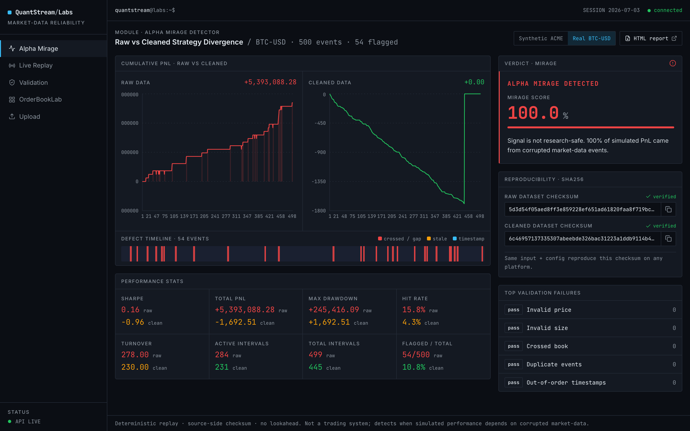
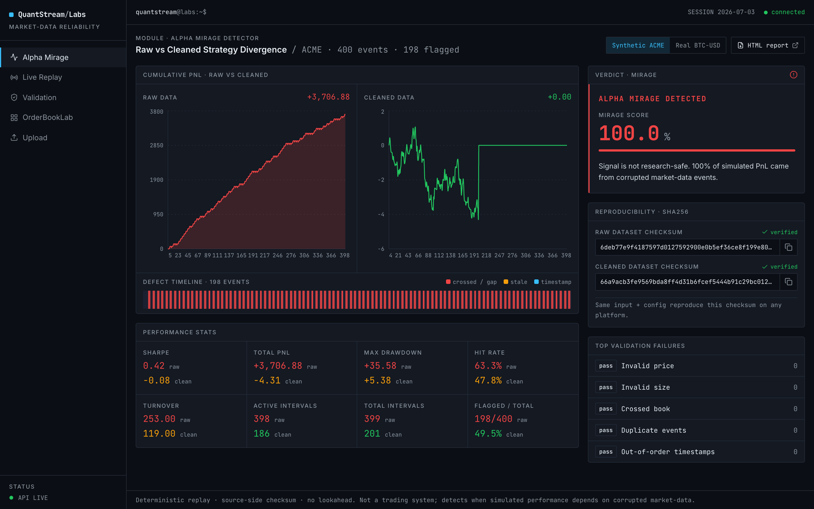
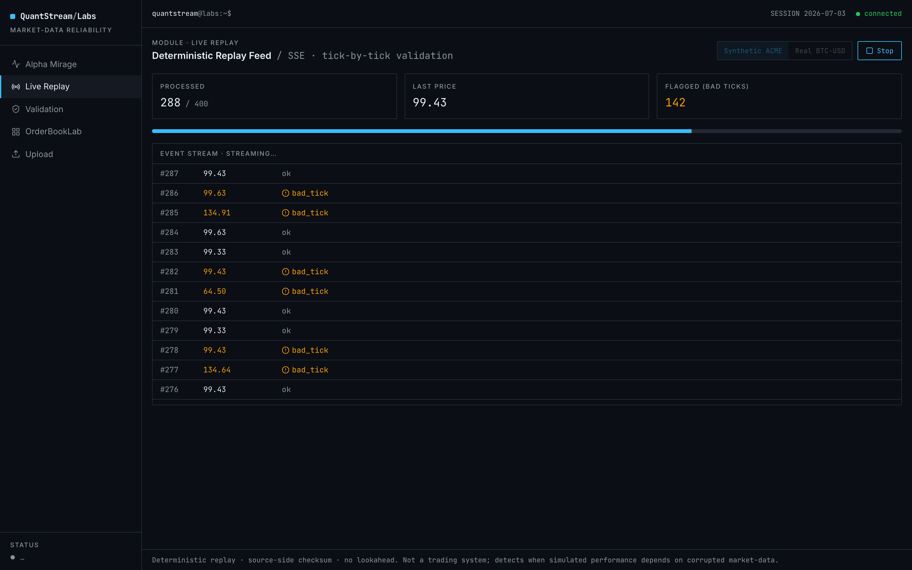
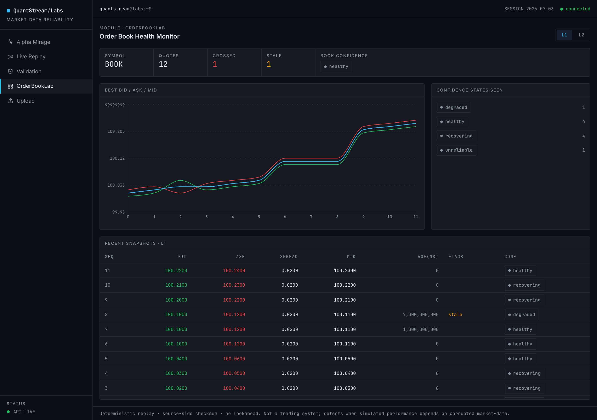
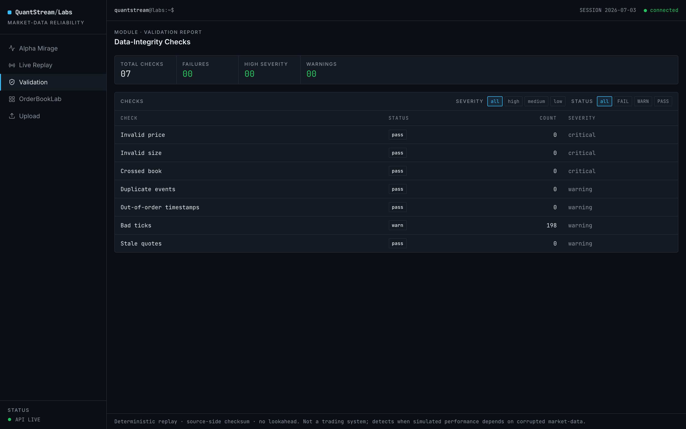

<div align="center">

# QuantStream Labs

### A deterministic market-data reliability platform that proves when a trading signal's *alpha* is actually caused by corrupted data.

[](https://github.com/JCHETAN26/QuantStream-Labs/actions/workflows/ci.yml)
[](https://quant-stream-labs.vercel.app)
[](https://www.python.org/)
[](https://en.cppreference.com/w/cpp/20)
[](#testing--continuous-integration)
[](LICENSE)

**[▶ Live demo](https://quant-stream-labs.vercel.app)** · [Alpha Mirage design](docs/alpha-mirage.md) · [Deterministic replay](docs/deterministic-replay.md) · [Methodology & limitations](docs/methodology.md)

</div>



---

## TL;DR for a quant researcher

You have almost certainly shipped a signal that looked great in backtest and died in
production because the **data** was broken — a stale quote, a crossed book, a fat-finger
print, a duplicate, an out-of-order timestamp. QuantStream Labs is built around that
failure mode. It:

1. **Validates** a market-data feed against a catalogue of microstructure defects.
2. **Replays** the feed deterministically — same bytes in, same **BLAKE2b checksum** out,
   reproduced **across languages (Python ↔ C++20)** and **across machines** (CI-enforced),
   on synthetic *and* real exchange data.
3. Runs a strategy on the **raw** feed vs. the **validation-cleaned** feed, charges
   **transaction costs**, and — with **causal, lookahead-free PnL attribution** — reports
   the **Alpha Mirage Score**: the fraction of apparent PnL that exists *only* because of
   corrupted events.

On a **real Coinbase BTC-USD tape**, a no-edge mean-reversion strategy shows a **+0.16
Sharpe** — but clean the 54 flagged bad ticks it was fading and it collapses to a **-0.96
Sharpe loser**. **100% of the apparent alpha was a data artifact.** That is the mirage.

> This is **not** a trading system and makes no claim to generate alpha. It is a
> research-integrity tool: it tells you when a signal's performance depends on bad data.

---

## Table of contents

- [The problem: fake alpha from broken data](#the-problem-fake-alpha-from-broken-data)
- [The Alpha Mirage Detector](#the-alpha-mirage-detector)
- [See it: the live platform](#see-it-the-live-platform)
- [Headline results](#headline-results)
- [Architecture](#architecture)
- [What makes it trustworthy](#what-makes-it-trustworthy-engineering-guarantees)
- [Quickstart](#quickstart)
- [The demo datasets](#the-demo-datasets)
- [Repository layout](#repository-layout)
- [Testing & continuous integration](#testing--continuous-integration)
- [Deployment](#deployment)
- [Honest limitations & roadmap](#honest-limitations--roadmap)
- [Tech stack](#tech-stack)
- [License](#license)

---

## The problem: fake alpha from broken data

Most market-data-driven signals are trusted before the data behind them is checked.
Out-of-order timestamps, duplicates, stale or crossed quotes, and bad ticks can make a
strategy look profitable for reasons that have **nothing to do with real edge**.

QuantStream Labs answers one question a research desk actually cares about:

> **Is this signal real — or is the alpha fake because the data is broken?**

The mechanism is concrete. Take a random walk with **no real edge** and inject periodic
**bad-tick spikes**. A mean-reversion strategy fades each spike and books the "reversion"
— which is just the bad tick correcting to fair value. It looks like a money-printer.
Remove the flagged events and the apparent profit **vanishes**. That gap is the mirage,
and QuantStream Labs quantifies and attributes it.

## The Alpha Mirage Detector

The detector runs the identical strategy twice and compares:

| | Raw feed | Validation-cleaned feed |
|---|---|---|
| Input | every event, defects included | flagged events removed |
| Result | inflated Sharpe / PnL | true (usually negative) performance |

- **Causal taint attribution** — a unit of PnL is marked *tainted* only when a
  defect-flagged event sits in its causal chain. No correlation hand-waving, **no
  lookahead** (enforced by a test).
- **Zero-defect control** — the same pipeline on a pristine feed produces **no mirage**,
  proving the detector isn't manufacturing one (anti-rigging).
- **One auditable number** — `mirage_score = tainted_PnL / total_PnL`. A score near
  100% with a research-unsafe verdict means the signal is a data artifact.

Full design: **[docs/alpha-mirage.md](docs/alpha-mirage.md)**.

## See it: the live platform

**[quant-stream-labs.vercel.app](https://quant-stream-labs.vercel.app)** — a live,
CI-gated deployment (React/TanStack frontend on Vercel → FastAPI backend on Fly.io).
Every number below is served by the real pipeline; toggle **Synthetic ACME / Real
BTC-USD** in the top right to switch data sources.

### Alpha Mirage dashboard

Raw-vs-cleaned equity curves, the verdict, the reproducibility checksums, the defect
timeline, and full raw/clean performance stats — here on the synthetic dataset:



### Live deterministic replay (SSE)

Stream the tape **tick-by-tick through validation**. Bad ticks light up as they arrive;
the flagged counter and progress bar update live. Served over Server-Sent Events through
the same-origin proxy:



### OrderBookLab — L1 & L2 reconstruction

Top-of-book (L1) and depth (L2) reconstruction with sequence-gap, crossed-book, and
stale-quote detection, driven by a shared **book-confidence state machine**
(`HEALTHY → DEGRADED → UNRELIABLE → RECOVERING`):



### Validation report

The full defect catalogue with counts and severities, plus the inferred schema:



You can also drop your **own CSV** on the Upload page (or `POST /api/analyze`): schema
inference parses it and runs the entire pipeline — the engine is not tied to the demo data.

## Headline results

Both are served live and locked by a committed regression fixture (`expected_results.json`).

### Synthetic ACME dataset — the controlled demonstration

```
Input: defective_trades.csv   Symbol: ACME   Events: 400   Validation failures: 198
Replay checksum (raw):   6deb77e9f4187597d0127592900e0b5ef36ce8f199e807bdc96891c74365dd29
Replay checksum (clean): 66a9acb3fe9569bda8ff4d31b6fcef5444b91c29bc012685627c1309af04b2c0

Raw Sharpe:   0.42     Raw PnL:   +$3,706.88
Clean Sharpe: -0.08     Clean PnL: -$4.31
Mirage Score: 100%      Verdict: ALPHA MIRAGE DETECTED (not research-safe)
```

### Real Coinbase BTC-USD tape — the credibility proof

A committed snapshot of **real** BTC-USD trades from the Coinbase public API, with
documented, seeded bad-tick injections:

```
Input: real Coinbase BTC-USD   Events: 500   Validation failures: 54
Raw Sharpe:   +0.16    (looks profitable)
Clean Sharpe: -0.96    (a net loser once the faded bad ticks are removed)
Mirage Score: 100%      Verdict: ALPHA MIRAGE DETECTED (not research-safe)
```

The same real tape, **without** injected defects, validates clean (0 natural defects) and
its deterministic replay checksum (`97ac17a8…`) is **reproduced byte-for-byte by the C++
engine in CI** — cross-language determinism proven on a real exchange tape, not just a toy.

## Architecture

A polyglot monorepo. Determinism is engineered **source-side** (a single-partition
canonical topic + checksum computed before transport), so the message bus is transport,
never a correctness dependency.

```
                 CSV / upload                     ┌─────────────────────────────┐
                      │                            │  Frontend (TanStack/React)  │
                      ▼                            │  Vercel · SSR proxy, no CORS │
        ┌──────────────────────────┐              └──────────────┬──────────────┘
        │  schema-worker           │   inference                 │ /api/backend/*
        │  CSV → canonical events  │                             ▼
        └────────────┬─────────────┘              ┌─────────────────────────────┐
                     ▼                             │  apps/api  (FastAPI)        │
        ┌──────────────────────────┐   defects    │  Fly.io · REST + SSE stream │
        │  validation-engine       │◀────────────▶└──────────────┬──────────────┘
        │  defect detection +      │                             │
        │  seeded corruptor        │                             ▼
        └────────────┬─────────────┘              ┌─────────────────────────────┐
                     ▼                             │  research-engine            │
        ┌──────────────────────────┐   BLAKE2b    │  backtest · costs · causal  │
        │  replay-engine (py)      │  checksum    │  taint · Alpha Mirage       │
        │  replay-engine-cpp (C++) │◀────────────▶└─────────────────────────────┘
        │  deterministic replay    │
        │  + Kafka/Redpanda sink   │              packages/contracts: canonical events,
        └──────────────────────────┘              fixed-point int64, canonical serialization
```

Supporting modules: **orderbook-lab** (L1/L2 reconstruction + confidence FSM) and
**dataset_registry** (deterministic generation, offline regeneration, SHA-256 verification).

## What makes it trustworthy (engineering guarantees)

- **Deterministic replay** — same input + config → same output, every time.
- **Cross-language determinism** — an independent **C++20** replay binary reproduces the
  Python **BLAKE2b-256** checksum byte-for-byte (CI-enforced, on synthetic *and* real data).
- **Cross-machine determinism** — the Linux CI reproduces the same bytes as local macOS;
  dataset generation uses `Decimal` + integer RNG only (no `libm`), so there are no
  platform-dependent floats.
- **Fixed-point everywhere** — prices/sizes are `int64` scaled by `1e9`, never float.
- **Canonical ordering** — one total order `(timestamp_ns, seq)`, applied everywhere.
- **Source-side checksum** — computed over the ordered stream *before* any transport;
  Redpanda/Kafka is transport only and is never claimed to provide determinism.
- **No lookahead** — taint attribution is causal and test-enforced.
- **Checksum-verified data** — the dataset ships `SHA256SUMS`; every fetch verifies and
  **fails loudly** on mismatch; the demo refuses to run on an unverified dataset.
- **Regression lock** — `make test-reproducibility` asserts every headline number
  (validation counts, both replay checksums, raw/clean Sharpe & PnL, mirage score,
  verdict) equals the committed `expected_results.json`.

## Quickstart

### One-command demo

```bash
make install            # editable-install every package (first time only)
make fetch-hf-demo      # acquire + verify the dataset (local cache → HF → offline gen)
make demo-alpha-mirage  # run the pipeline, print the verdict, write the HTML report
```

This prints the terminal verdict and writes `quantstream-report.html`, a static
research-integrity report. Verify the result is reproducible:

```bash
make test-reproducibility   # re-runs the pipeline; fails if any headline number drifts
cd data/demo && shasum -a 256 -c SHA256SUMS   # verify the dataset checksums yourself
```

### Everything in Docker

```bash
docker compose up --build        # demo + API + Redpanda
# API then serves at http://localhost:8000  (/docs, /api/demo, /api/demo?source=real)
```

### Frontend (local dev)

```bash
cd frontend/alpha-guard-stream
npm install && npm run dev       # proxies /api/backend/* → API_BASE (default :8000)
```

### Develop

```bash
make test    # run every package's suite (209 Python tests)
make lint    # ruff
```

## The demo datasets

The synthetic demo runs on `JCHETAN26/quantstream-alpha-mirage`, a fixed, checksummed
dataset that **regenerates byte-for-byte offline** (Hugging Face is a registry, not a
runtime dependency):

| File | Purpose |
| --- | --- |
| `defective_trades.csv` | Trades with injected bad-tick spikes (drives the mirage). |
| `clean_trades.csv` | Pristine control (no defects, no mirage). |
| `defective_quotes.csv` | Quotes with crossed books, bad prices, and a stale block. |
| `clean_quotes.csv` | Pristine control quotes. |
| `defect_manifest.json` | Ground-truth injected defects per file. |
| `expected_results.json` | Canonical expected pipeline output (the regression lock). |
| `SHA256SUMS` | SHA-256 of the six files above. |

The real tape lives in [`data/real/`](data/real/) — a committed Coinbase BTC-USD snapshot
with provenance and a locked replay checksum.

## Repository layout

```text
packages/
  contracts/            canonical events, fixed-point price/size, deterministic serialization
services/
  schema-worker/        schema inference + CSV loading into canonical events
  validation-engine/    defect detection + seeded corruption injector
  replay-engine/        deterministic replay, source-side checksum, Kafka/Redpanda sink
  replay-engine-cpp/    C++20 replay engine (matches the Python checksum byte-for-byte)
  research-engine/      backtest, transaction costs, PnL taint attribution, Alpha Mirage
  orderbook-lab/        L1/L2 book reconstruction, gap/crossed/stale detection, confidence FSM
  dataset_registry/     dataset generation, offline regeneration, SHA-256 verification
apps/
  demo/                 official-dataset CLI + HTML research-integrity report
  api/                  FastAPI gateway (REST + SSE) over the same pipeline
frontend/
  alpha-guard-stream/   TanStack Start (React) UI: dashboard, live replay, orderbook, upload
data/
  demo/                 the checksummed synthetic dataset
  real/                 the committed real Coinbase BTC-USD tape
docs/                   architecture, deterministic replay, validation rules, methodology
```

## Testing & continuous integration

Every push and PR runs three CI jobs against a protected `main` (linear history, required
checks, no force-push):

| Job | What it proves |
| --- | --- |
| **contracts** | 209 Python tests across every package, on Python 3.10 / 3.11 / 3.12; `ruff` lint. |
| **cpp** | Builds the C++20 replay engine and asserts its checksum **equals Python's** on the synthetic dataset **and** the real Coinbase tape. |
| **docker** | Builds the production image (dataset generated + SHA-verified at build). |

The project was built across **23 reviewed pull requests** — nothing lands on `main`
without green CI.

## Deployment

Live architecture: **frontend on Vercel**, **backend on Fly.io**, wired through a
server-side proxy so the browser stays same-origin (no CORS).

```
visitor → Vercel (TanStack SSR UI) → /api/backend/* proxy → Fly.io (FastAPI + SSE)
```

Full instructions (including an all-Vercel option via Python serverless functions) are in
**[DEPLOY.md](DEPLOY.md)**. The FastAPI backend also reads `$PORT`, so it runs unchanged
on Fly / Render / Railway / Cloud Run from the repo `Dockerfile`.

## Honest limitations & roadmap

Stating assumptions is the whole point of a research-integrity tool, so here are the real
ones (also in **[docs/methodology.md](docs/methodology.md)**):

- **Fill model is mark-to-trade.** PnL marks against the trade print with a per-unit
  transaction cost. It does **not** yet model mark-to-mid against an aligned book,
  size-dependent market impact, or partial fills. *Roadmap: a microstructure-aware fill
  model.*
- **Data is synthetic + one real snapshot.** The engine runs on a real Coinbase tape and
  accepts arbitrary real data via upload, but the shipped datasets are a synthetic
  generator plus one committed real snapshot — not a live production tape. *Roadmap:
  streaming ingestion of a live feed.*
- **Sharpe.** The headline is a **per-trade** Sharpe. An annualized figure is also
  computed but carries an explicit high-frequency-inflation caveat.
- **OrderBookLab** runs on synthetic L1/L2 fixtures (real depth data isn't in the demo).

None of these are hidden in the marketing — the docs state them, and the code does exactly
what the docs say.

## Tech stack

**Python 3.10–3.12** (contracts, validation, replay, research, schema, orderbook, dataset
registry, demo) · **C++20** (independent replay engine) · **FastAPI** (REST + SSE gateway)
· **TypeScript / React / TanStack Start** (frontend) · **Redpanda / Kafka** (canonical
event transport) · **Docker Compose** · **GitHub Actions** CI · deployed on **Vercel** +
**Fly.io**.

## Design docs

- [Backend architecture](docs/backend-architecture.md)
- [Deterministic replay](docs/deterministic-replay.md)
- [Validation rules](docs/validation-rules.md)
- [Alpha Mirage design](docs/alpha-mirage.md)
- [Methodology, costs & limitations](docs/methodology.md)
- [Local demo & privacy](docs/local-demo.md)

## License

Released under the [MIT License](LICENSE).
